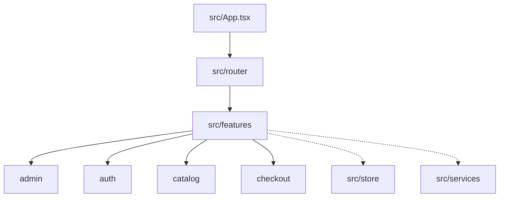

# Shopiy Frontend Workspace
**Senior Developer Candidate Assessment Project Documentation**

---

## 1. Project Overview

**Shopiy Frontend** is a premium, interactive Single Page Application (SPA) client built to interface with the Shopiy .NET Web API. Designed with a modern, responsive user experience, the application features:
- **Responsive E-Commerce Storefront:** Fluid catalog layouts with dynamic category filters, price sorting, and item searches.
- **Admin Dashboard:** High-fidelity management panels for products, orders, categories, and order fulfillment status pipelines.
- **Spec Sheet Customization:** Interactive specifications builder resolving complex product options dynamically from PostgreSQL JSONB metadata.
- **State-of-the-Art UX:** Smooth animations, bento grid showcases, and glassmorphism overlays optimized for high engagement.

---

## 2. Tech Stack & Architecture

The application is structured as a decoupled Single Page Application (SPA):

*   **Core Library:** React 19.0 (leveraging the new Concurrent Rendering features)
*   **Build Tooling & Server:** Vite 6.0 (configured for hot-module reloading and optimized static asset packaging)
*   **Language:** TypeScript (strict type safety for models, components, and hooks)
*   **Styling Engine:** **Tailwind CSS v4** (using the compile-time `@tailwindcss/vite` plugin for lightning-fast build cycles)
*   **State Management:** **Zustand v5** (decoupled store models for Auth, Cart, and UI settings with automatic LocalStorage synchronization)
*   **Server State Synchronization:** **TanStack React Query v5** (handling caching, automatic revalidation, and mutation-based cache invalidation)
*   **Routing System:** React Router DOM v7
*   **Client API Integration:** Axios (with centralized request/response interceptors to attach bearer tokens and handle network telemetry)
*   **Animations:** Motion v12 (delivering premium micro-animations)

---

## 3. Frontend Directory & Feature Architecture

The React frontend utilizes a modular, **feature-based directory structure** combined with centralized service and state management layers. This architecture groups related UI elements, logic, hooks, and views into dedicated domain features, ensuring high maintainability and scalability.



### Architectural Breakdown

#### A. Feature Modules ([src/features](file:///f:/Assissment/frontend/src/features))
Each domain feature module contains its own folder with assets, components, hooks, views, or helper utilities unique to that feature:
*   **`admin`:** Components and custom hooks (like [useAdminOrders.ts](file:///f:/Assissment/frontend/src/features/admin/hooks/useAdminOrders.ts), [useAdminCategories.ts](file:///f:/Assissment/frontend/src/features/admin/hooks/useAdminCategories.ts)) for product stock, categories, and global order fulfillment dashboard pipelines.
*   **`auth`:** Pages and forms for authentication management (Login, Register).
*   **`catalog`:** Storefront interfaces including dynamic category browsing, search, and the interactive spec sheet customization builder.
*   **`checkout`:** Shipping details form inputs, order overview reviews, and payment/idempotency-key dispatch orchestrations.

#### B. Centralized Shared Assets & Components ([src/components](file:///f:/Assissment/frontend/src/components))
*   Contains core reusable UI primitives (e.g. Buttons, Inputs, Dialog Modals, and high-fidelity overlays) that are used across multiple features.

#### C. Global Client State Store ([src/store](file:///f:/Assissment/frontend/src/store))
*   Uses **Zustand** to manage lightweight client-side application states decoupled from the view hierarchy.
*   Includes [authStore.ts](file:///f:/Assissment/frontend/src/store/authStore.ts) (managing JWT credentials and validation states) and [cartStore.ts](file:///f:/Assissment/frontend/src/store/cartStore.ts) (managing customer cart items and quantities, automatically serialized to LocalStorage).

#### D. Server State & Data Synchronizer ([src/services](file:///f:/Assissment/frontend/src/services) & TanStack Query)
*   Uses a centralized Axios client instance ([api.ts](file:///f:/Assissment/frontend/src/services/api.ts)) equipped with request and response interceptors to automatically attach authorization tokens and capture/route global errors.
*   Uses custom react-query hooks to synchronize and cache external API queries and orchestrate mutations with automated invalidation triggers.

---

## 4. Quick Start & Installation

### Prerequisites
- Node.js (v20 or higher recommended)
- npm package manager

### Local Development Setup

1.  **Install project dependencies:**
    ```bash
    npm install
    ```
2.  **Configure Environment Variables:**
    Create a local environment file `.env` in the frontend root directory:
    ```env
    VITE_API_URL=http://localhost:5000
    VITE_APP_NAME=Shopiy
    ```
3.  **Launch the Vite Dev Server:**
    ```bash
    npm run dev
    ```
    The application will compile and start locally at `http://localhost:3000` (mapped to respond to any local IP).

4.  **Static Production Build Compilation:**
    To compile and minify static files for production deployment:
    ```bash
    npm run build
    ```
    The compiled, tree-shaken static assets are output to the `dist/` directory.

---

## 5. Docker Deployment & Production Nginx Hosting

The frontend contains a production-ready **multi-stage Dockerfile** designed to optimize load-times and security.

### Production Execution
Build the optimized static assets and host them inside an Nginx server wrapper:
```bash
docker compose up -d --build
```
This boots the `shopiy-frontend` container, serving on port **`8081`** (customizable via `SHOPIY_FRONTEND_PORT`).

### Production Nginx Features
The production stage utilizes `nginx.conf` to enforce:
- **SPA Routing Fallback:** All non-file route requests are redirected to `index.html` to support client-side React routing.
- **Cache-Control Policies:** Long-term caching is enabled for immutable hashes (images, CSS, JS), while `index.html` is kept cache-free to ensure instant deployment updates.
- **Gzip Compression:** On-the-fly text compression to minimize bandwidth and page-load latency.

---

## 6. Front-End System Design & Trade-offs

### A. Tailwind CSS v4 with Native Vite Integration
*   **Decision:** Upgraded to Tailwind CSS v4 and the native `@tailwindcss/vite` compiler.
*   **Rationale:** Traditional Tailwind workflows rely on PostCSS processing, which increases asset compilation times. Tailwind v4 parses CSS directly within Vite's build pipeline, decreasing compilation overhead by up to 5x. This enables seamless styling adjustments during development and generates highly optimized, utility-based stylesheets.

### B. Zustand for Client State vs. Redux Toolkit
*   **Decision:** Selected Zustand v5 for client-side app states (Cart, Auth token, UI states).
*   **Rationale:** Redux Toolkit introduces high boilerplate (actions, reducers, store mappings) that is unnecessary for local storefront states. Zustand uses a simple, hooks-based API, does not require context providers (preventing full-tree re-renders), and natively supports state persistence using the `persist` middleware.

### C. React Query for Server Cache Synchronization
*   **Decision:** Managed API fetch state via TanStack React Query instead of local `useEffect` fetches.
*   **Rationale:** Direct API calls in React components suffer from missing cache synchronization, duplicate network calls, and complex loading/error states. React Query acts as an in-memory cache layer. When an admin updates a product, the mutation automatically invalidates the query cache key, triggering atomic, seamless updates across the storefront UI without full page loads.

### D. Centralized Axios Interceptors
*   **Decision:** Configured a central Axios instance with request and response interceptors.
*   **Rationale:** Centralizing API calls guarantees that outgoing requests automatically carry the JWT Authorization header, and incoming `401 Unauthorized` or `409 Conflict` errors are intercepted globally. This redirects users to auth pages or displays user-friendly notifications (via `react-hot-toast`) without polluting individual component code.

---

## 7. Catalog Filtering & Search Implementation

The product catalog uses a hybrid approach to query, filter, and sort products to optimize catalog responsiveness:

### A. Server-Side Filtering (Category & Search)
- **Category Filter:** When a category is selected in the sidebar, the frontend attaches the `categoryId` as a query parameter (`/api/v1/Products?categoryId={id}`) via React Query. The backend handler executes a database-level filter on PostgreSQL to load only relevant items.
- **Search Query:** The sidebar search bar binds to `searchQuery` (managed globally via the Zustand `uiStore` to persist search terms across page navigation). This triggers a React Query fetch passing the `search` query parameter. The C# backend matches this string against product `Name`, `Description`, and `SKU` using case-insensitive database queries.

### B. Client-Side Sorting
- Once the filtered subset of products is returned from the API, the frontend performs client-side sorting inside a React `useMemo` block based on the user's selected preference:
  - **Featured:** Displays products in default database sequence.
  - **Price Low-to-High:** Sorts products ascendingly: `list.sort((a, b) => a.price - b.price)`.
  - **Price High-to-Low:** Sorts products descendingly: `list.sort((a, b) => b.price - a.price)`.
- By delegating sorting to the client-side `useMemo` cache, the application completely eliminates subsequent database queries and network roundtrips for sorting adjustments, achieving zero-latency transitions for users.
